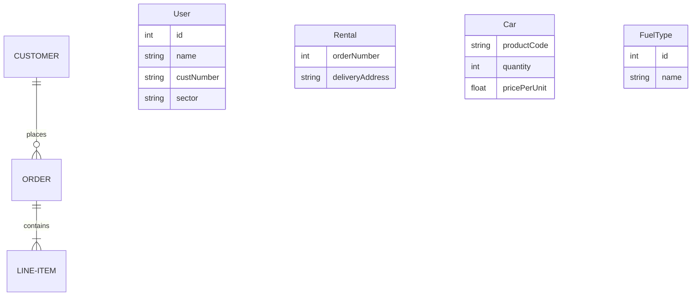

```mermaid
erDiagram
    CUSTOMER ||--o{ ORDER : places
    User {
        int id
        string name
        string custNumber
        string sector
    }
    ORDER ||--|{ LINE-ITEM : contains
    Rental {
        int orderNumber
        string deliveryAddress
    }
    Car {
        string productCode
        int quantity
        float pricePerUnit
    }
    FuelType {
        int id
        string name
    }
```
