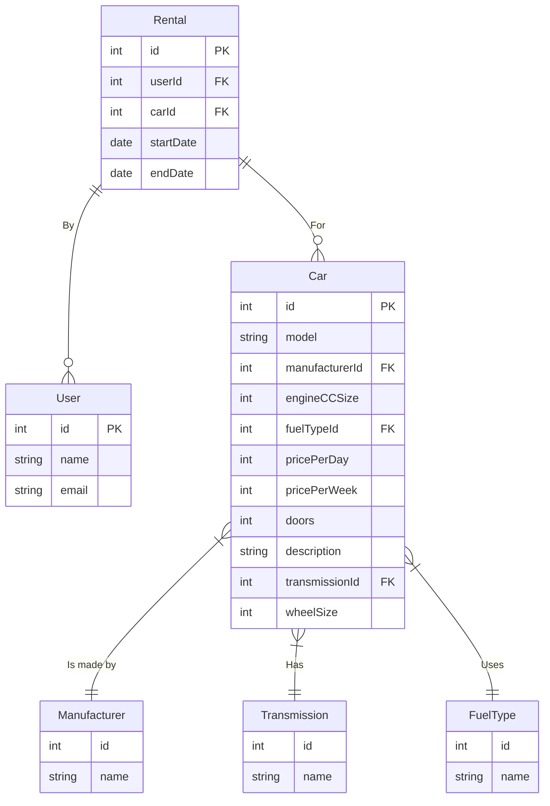

```mermaid
erDiagram
    User {
        int id PK
        string name
        string email
    }
    Rental {
        int id PK
        int userId FK
        int carId FK
        date startDate
        date endDate
    }
    Car {
        int id PK
        string model
        int manufacturerId FK
        int engineCCSize
        int fuelTypeId FK
        int pricePerDay
        int pricePerWeek
        int doors
        string description
        int transmissionId FK
        int wheelSize
    }
    Manufacturer {
        int id
        string name
    }
    Transmission {
        int id
        string name
    }
    FuelType {
        int id
        string name
    }
    
    Rental ||--o{ User : By
    Rental ||--o{ Car : For
    Car }|--|| Manufacturer : "Is made by"
    Car }|--|| Transmission : "Has"
    Car }|--|| FuelType : "Uses"

%%    CUSTOMER ||--o{ ORDER : places
    
```
